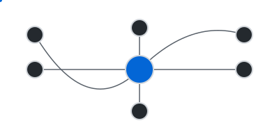

  

 

<table>
  <tr>
    <td valign="top" width="65%">
      <h2 align="left">My Philosophy</h2>
      

        I engineer digital ecosystems. My work bridges deep back-end architecture with intelligent, human-centric user experiences. I don't just build applications; I design resilient, scalable platforms built for tomorrow's demands.
      

      <ul>
        <li>
          🧠 <strong>Systematic Design:</strong> Architecting secure, scalable, and AI-augmented platforms is the foundation of my work. Every great build starts with a clear blueprint.
        </li>
        <li>
          ⚙️ <strong>Full-Stack Execution:</strong> I command the entire technology stack, from optimizing Linux environments with <strong>Node.js</strong> to crafting intuitive front-ends with <strong>React</strong> and <strong>TypeScript</strong>.
        </li>
        <li>
          🇽🇰 <strong>Local Impact, Global Standards:</strong> My mission is to elevate Kosovo’s tech landscape by delivering software that competes on the world stage.
        </li>
      </ul>
      

        <em>If you're building a purpose-driven platform, we should talk.</em>
      

    </td>
    <td valign="top" width="35%">
      

        <!-- This now points to your custom, theme-aware, animated SVG -->
        
      

    </td>
  </tr>
</table>

---

### 🚀 My Core Focus & Tech Arsenal

  
<strong>Click to expand my full Tech Stack & Tools</strong>

   
  
  <table>
    <tr>
      <td valign="top" width="50%">
        <strong>Languages & Core Tech:</strong> 
        

          
          
          
          
          
          
          
        

        <strong>Frontend Development:</strong> 
        

          
          
          
          
          
        

        <strong>Backend Development:</strong> 
        

          
          
          
          
        

        <strong>Databases:</strong> 
        

          
          
        

        <strong>AI & Machine Learning:</strong> 
        

            
            
        

      </td>
      <td valign="top" width="50%">
        <strong>DevOps & Cloud:</strong> 
        

          
          
          
          
          
          
          
          
        

        <strong>Design & Prototyping:</strong> 
        

          
          
          
        

        <strong>Tools & Utilities:</strong> 
        

          
          
          
          
          
        

        <strong>Hardware & IoT:</strong> 
        

            
            
            
        

      </td>
    </tr>
  </table>

 

---

### 📊 My GitHub Pulse

  
  
   
  
   
  
   
  <!-- GitHub Contribution Snake -->
  

 

---

### 🤝 Let's Connect & Collaborate

  I'm always open to connecting with fellow innovators and creators. Let's discuss system design, AI, or the future of tech.

   &nbsp;
   &nbsp;
   &nbsp;
  

  

