<!-- HEADER & BANNER -->

  

  

 

<!-- ABOUT / PHILOSOPHY - Centered for Mobile Scalability -->

  
   
  
  <h3 style="border-bottom: 2px solid #38BDF8; display: inline-block; padding-bottom: 5px;">
    The Engineering Philosophy
  </h3>
  
  

    I don't just write code; <strong>I engineer outcomes.</strong> 
    My focus lies in building high-availability distributed systems and intuitive user experiences. Whether optimizing Linux kernels or crafting pixel-perfect React frontends, my work is defined by <strong>scalability</strong>, <strong>security</strong>, and <strong>purpose</strong>.
  

  

    🚀 <strong>Mission:</strong> Elevating the digital landscape of Kosovo to compete on the global stage.
  

 

<!-- TECH STACK - Categorized & Clean -->
<h2 align="center">⚡ Technology Arsenal</h2>

  
  <!-- Stack 1: Core & Backend -->
  <table>
    <tr>
      <td align="center" width="900">
        <kbd><strong>CORE INFRASTRUCTURE & BACKEND</strong></kbd>
          
        
      </td>
    </tr>
  </table>

  <!-- Stack 2: Frontend & Design -->
  <table>
    <tr>
      <td align="center" width="900">
        <kbd><strong>FRONTEND ECOSYSTEM & UI</strong></kbd>
          
        
      </td>
    </tr>
  </table>
  

 

<!-- ANALYTICS - Minimalist Dark Mode -->
<h2 align="center">📈 Performance Metrics</h2>

  
  

  

 

<!-- FOOTER / CONNECT -->

  
  
  <h3>🤝 Let's Architect the Future</h3>
  
  

    
    &nbsp;
    
    &nbsp;
    
  

   
  
  

    console.log("Designed by Eron Bruti © 2025");
  

